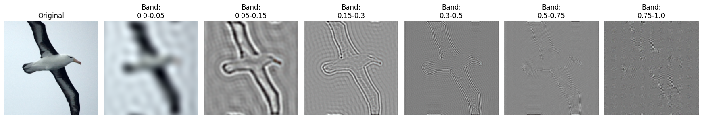
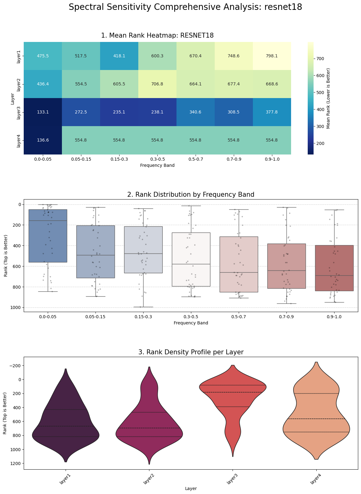
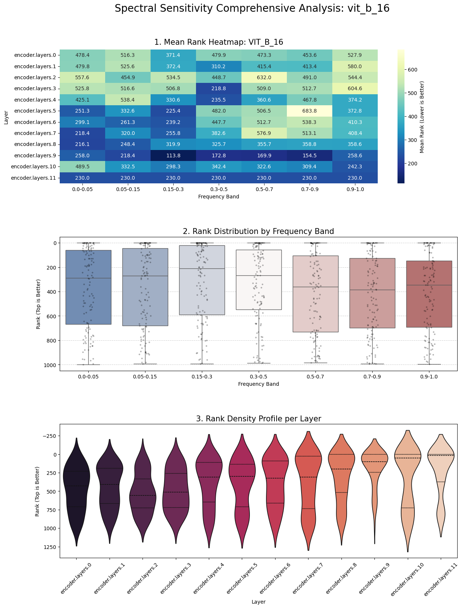
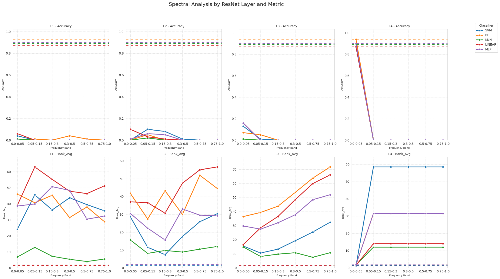
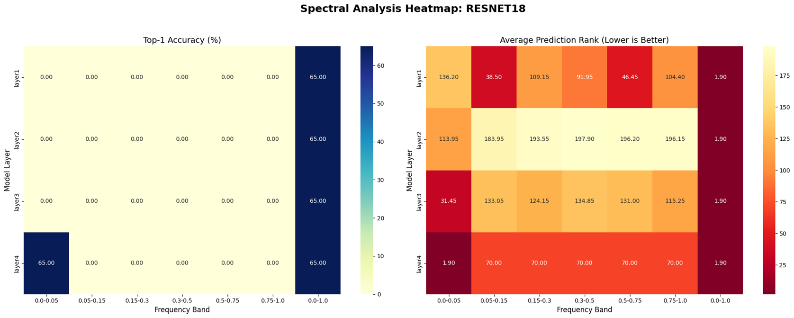
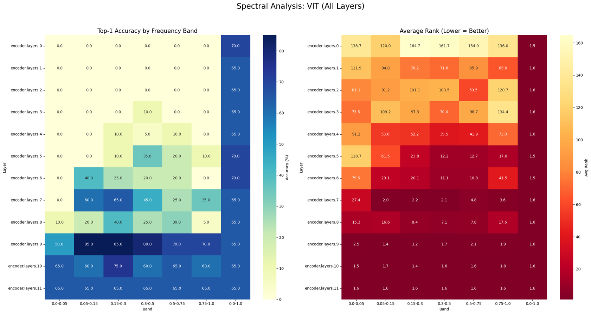
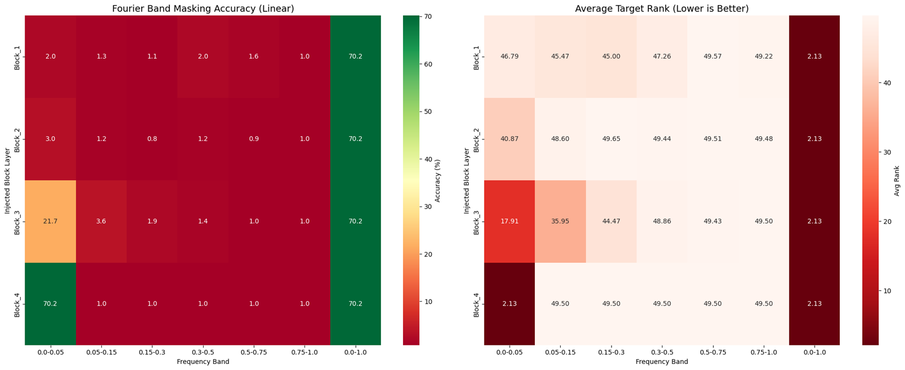
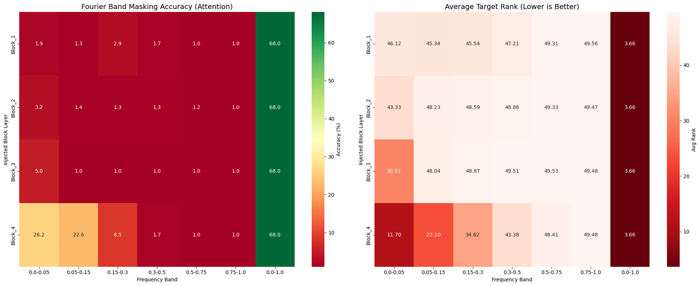
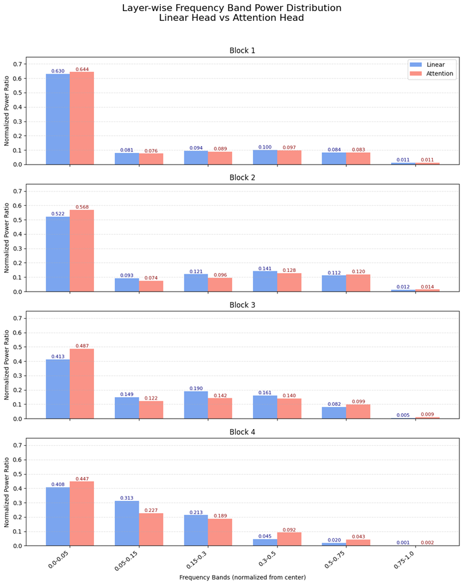

# Results

Figures from the exploratory runs behind this project. They were produced in Colab between late January and early February 2026, before the code was reorganized into `Experiments/`. Sample sizes are small. Read the **Notes** under each experiment together with the figures: several patterns in these plots are fixed by how the model reads out its prediction, not by what the representation contains.

## Files

| File | Experiment | Content |
|---|---|---|
| `00_band_decomposition_example.png` | Method | Band isolation applied to an input image |
| `01_layerwise_spectral_resnet18_imagenet1k.png` | 1. Layer-wise / architecture | ResNet-18: mean GT rank per layer and band, rank distributions |
| `01_layerwise_spectral_vitb16_imagenet1k.png` | 1. Layer-wise / architecture | ViT-B/16: mean GT rank per block and band, rank distributions |
| `02_classifier_dep_resnet18_imagenet100.png` | 2. Classifier dependence | Accuracy and mean rank per band for five classifiers on frozen ResNet-18 features |
| `03_dataset_dep_resnet18_cub200.png` | 3. Dataset dependence | ResNet-18 on CUB-200-2011: accuracy and mean rank per layer and band |
| `03_dataset_dep_vitb16_cub200.png` | 3. Dataset dependence | ViT-B/16 on CUB-200-2011: accuracy and mean rank per block and band |
| `04_head_nonlin_joint_linear.png` | 4. Head / joint training | 4-block CNN trained with a linear head: accuracy and mean rank per block and band |
| `04_head_nonlin_joint_attention.png` | 4. Head / joint training | Same CNN trained with a spatial self-attention head |
| `04_head_nonlin_joint_band_power.png` | 4. Head / joint training | Share of spectral power per band in each block's output, linear vs. attention model |

## Common setup

- **Intervention.** Take the feature map at one layer, apply a 2D FFT per channel, keep a single radial band of the (shifted) spectrum, apply the inverse FFT, and continue the forward pass with the filtered map. Radii are normalized so that the largest radius in the spectrum is 1.
- **Bands.** Experiment 1 uses seven bands: 0–0.05, 0.05–0.15, 0.15–0.3, 0.3–0.5, 0.5–0.7, 0.7–0.9, 0.9–1.0. Experiments 2–4 use six: 0–0.05, 0.05–0.15, 0.15–0.3, 0.3–0.5, 0.5–0.75, 0.75–1.0. Figures in experiments 3–4 also show the unfiltered map (0.0–1.0) as a reference column.
- **Small maps.** On small feature maps the lowest band (0–0.05) contains only the DC bin, i.e. the per-channel spatial mean. This is the case for ResNet-18 `layer2`–`layer4` (28×28, 14×14, 7×7), for the ViT-B/16 patch grid (14×14), and for blocks 3–4 of the CNN in experiment 4 (28×28).
- **Metrics.** Top-1 accuracy, and mean ground-truth (GT) rank: the position of the true class when all classes are sorted by score (1 is best; about half the number of classes is chance level).

*Band isolation on an input image, for intuition only. It uses the six bands of experiments 2–4.*

---

## 1. Layer-wise behavior and architecture (ImageNet-1K)

**Setup.** torchvision ResNet-18 and ViT-B/16 (ImageNet-1K pretrained, frozen, original classification heads). The band filter is applied to the output of one ResNet stage (`layer1`–`layer4`) or one ViT encoder block (`encoder.layers.0`–`11`). In ViT only the patch tokens are filtered; the CLS token is left as is. The rest of the network then runs unchanged. N = 10 validation images per model; metric = mean GT rank over 1,000 classes (chance ≈ 500).

**Observations**

- ResNet-18: `layer1`–`layer2` stay near chance for every band (mean rank 418–798). At `layer3` the lowest band, here the DC bin alone, is the most informative single band (133.1); the other bands range from 235 to 378.
- ViT-B/16: which band is most informative changes from block to block (e.g., block 3 is best at 0.3–0.5 with 218.8). Block 9 is informative in every band (113.8–258.6).

**Notes**

- **The ResNet `layer4` row is fixed by the readout.** `layer4` is followed by global average pooling, and the spatial mean of a feature map is exactly its DC Fourier coefficient divided by H·W. On the 7×7 `layer4` map, the 0–0.05 band contains only the DC bin. Keeping that band therefore reproduces the unfiltered prediction, and keeping any other band feeds all-zero features to the classifier, which is why every other band shows the same value (554.8). This row says nothing about learned spectral content, so only `layer1`–`layer3` are informative.
- **The ViT block 11 row is fixed as well.** The head reads the CLS token, which the filter never touches, so every band returns the unfiltered prediction (230.0). In earlier blocks the CLS token also carries information around the filter. ViT's robustness across bands in late blocks is therefore partly this bypass, and ResNet has no equivalent path, so the two architectures are not compared on equal terms here.
- **The unfiltered baseline needs checking.** The two rows above give the unfiltered mean ranks directly: 136.6 for ResNet-18 and 230.0 for ViT-B/16. Pretrained models with 70–80% top-1 accuracy should score far lower, whereas the CUB-200 runs in experiment 3 show sensible baselines. Label mapping or preprocessing in this ImageNet-1K run should be re-verified before the absolute numbers are used.

---

## 2. Classifier dependence (ResNet-18, ImageNet-100)

**Question.** Are high frequencies unused because a linear classifier cannot exploit them?

**Setup.** The ResNet-18 backbone is frozen. Five classifiers (SVM, random forest, KNN, linear, MLP) are trained on clean ImageNet-100 features, using 500 images per class. Full-frequency accuracy of each classifier: SVM 73.26%, RF 76.34%, KNN 77.42%, linear 78.04%, MLP 78.22%. The band filter is applied at `layer1`–`layer4`; the filtered map then continues through the backbone, and each classifier reads the pooled features. Evaluation uses 128 images. Dashed lines show clean performance on the same 128 images.

**Observations**

- `layer1`–`layer3`: every classifier drops to near-zero accuracy for every single band (at most ≈ 0.16), against clean baselines of ≈ 0.87–0.94. At `layer3`, mean rank rises with frequency for most classifiers.
- `layer4`: the lowest band restores clean accuracy for all five classifiers. Every other band gives zero accuracy, with the same rank regardless of band.

**Notes**

- All five classifiers read average-pooled features, so the `layer4` result is the same pooling identity as in experiment 1. The choice of classifier cannot matter there.
- At `layer1`–`layer3`, no single band, including the lowest, is enough for any classifier. This experiment therefore cannot separate "high frequencies were discarded by the backbone" from "one band alone carries too little information."
- KNN and random forest produce vote-based class probabilities with many exact ties, so their rank curves depend on how ties are broken. They are not directly comparable to the SVM, linear, and MLP curves.

---

## 3. Dataset dependence (CUB-200-2011)

**Question.** Does a fine-grained dataset push representations toward higher frequencies?

**Setup.** CUB-200-2011: 200 classes, 5,994 training and 5,794 test images. Pretrained ResNet-18 and ViT-B/16 backbones are frozen; a new linear head is trained without data augmentation, reaching about 65% accuracy for both models. The evaluation subset is small: accuracies move in 5% steps, i.e. about 20 images.

**Observations**

- ResNet-18: every single band gives 0% top-1 at `layer1`–`layer3`. By rank, the lowest band is best at `layer3` (31.45, against 115–135 for the others) and at `layer2` (113.95, against 184–198). `layer1` is mixed: its best ranks are in the 0.05–0.15 and 0.5–0.75 bands. The overall picture is the same as on ImageNet, with no sign that fine-grained data pushes ResNet toward higher bands in this setup.
- ViT-B/16: single bands start to carry class information from about block 5. In blocks 5–7 the lowest band is the *worst* band (e.g., at block 7 its rank is 27.4, against 2.0–4.8 for the other bands). By blocks 9–10, almost every band on its own gives near-baseline accuracy.

**Notes**

- The ResNet `layer4` row (lowest band identical to the unfiltered map, every other band at rank 70.00) and the ViT block 11 row (identical to the unfiltered map) are fixed by the readout, as in experiment 1.
- With about 20 images, a difference of one or two images (5–10 points) is noise. For example, some block 9 bands score 85%, above the 65% unfiltered baseline.

---

## 4. Head and joint training (4-block CNN, ImageNet-100)

**Question.** Does a more expressive head change how the representation uses frequencies?

**Setup.** The backbone is a 4-block VGG-style CNN: each block has two conv–BN–ReLU layers, with max pooling after blocks 1–3 (224 → 112 → 56 → 28). It is trained end to end from scratch with one of two heads:

- (a) global average pooling followed by a linear classifier;
- (b) a spatial self-attention head (1×1-conv query/key/value over the H·W positions, a learned residual weight γ), followed by global average pooling and a linear classifier.

Unfiltered accuracy is 70.2% for the linear model and 68.0% for the attention model. The band filter is applied to the output of each block.

**Observations**

- Blocks 1–3: both models stay near chance (1%) for almost every band. The exception is the lowest band at block 3 (21.7% for the linear model, 5.0% for the attention model).
- Block 4, linear head: the lowest band gives the unfiltered accuracy (70.2%). Every other band is at chance (1.0%), with a mean rank of 49.50 in every case.
- Block 4, attention head: accuracy falls smoothly with frequency: 26.2% (0–0.05), 22.6% (0.05–0.15), 8.5% (0.15–0.3), 1.7% (0.3–0.5), and chance above that.

Share of spectral power per band in each block's output:

| Block | Model | 0–0.05 | 0.05–0.15 | 0.15–0.3 | 0.3–0.5 | 0.5–0.75 | 0.75–1.0 |
|---|---|---|---|---|---|---|---|
| 1 | Linear | 0.630 | 0.081 | 0.094 | 0.100 | 0.084 | 0.011 |
| 1 | Attention | 0.644 | 0.076 | 0.089 | 0.097 | 0.083 | 0.011 |
| 2 | Linear | 0.522 | 0.093 | 0.121 | 0.141 | 0.112 | 0.012 |
| 2 | Attention | 0.568 | 0.074 | 0.096 | 0.128 | 0.120 | 0.014 |
| 3 | Linear | 0.413 | 0.149 | 0.190 | 0.161 | 0.082 | 0.005 |
| 3 | Attention | 0.487 | 0.122 | 0.142 | 0.140 | 0.099 | 0.009 |
| 4 | Linear | 0.408 | 0.313 | 0.213 | 0.045 | 0.020 | 0.001 |
| 4 | Attention | 0.447 | 0.227 | 0.189 | 0.092 | 0.043 | 0.002 |

**Notes**

- The linear head sits after global average pooling, which passes only the DC component, so at block 4 it cannot use any other band regardless of its capacity. An MLP head behaved the same way (figure not kept), which is consistent with it sitting after the same pooling. The attention head re-weights spatial positions by their content *before* pooling, so non-DC content does reach the classifier. The contrast between the two heads is best explained by this readout, not by low frequencies being linearly separable and high frequencies not.
- The power shares are not normalized by the number of frequency bins in each band. Block outputs are also post-ReLU and therefore non-negative, so a large DC share is expected regardless of what the network encodes.

---

## Takeaways

**Supported, with small samples**

- In ResNet-18's intermediate layers (`layer2`–`layer3`), the lowest band is the most informative single band, well ahead of the others. This holds on both ImageNet and CUB-200. On these maps that band is the DC bin alone, so the finding is specifically that per-channel spatial means carry more class information than any other single band.
- At the last block, a head can use non-DC bands only if it mixes spatial content before pooling. A pooling → linear head sees the DC component alone.

**Not established by these runs**

- That ResNet representations collapse onto ultra-low frequencies at the last stage: this is the pooling identity.
- That ViT preserves information across all bands: this is partly the unfiltered CLS path.
- That high-frequency information is already discarded by the backbone: single-band isolation fails for *every* band at `layer1`–`layer3`, so these runs cannot tell the two explanations apart.

## Next steps

- Use a readout that is not a spatial mean at the last stage, such as a probe on the flattened map or the attention head from experiment 4.
- Also filter (or ablate) the ViT CLS token, or compare against a mean-pooled patch readout.
- Normalize band power per frequency bin and use mean-subtracted spectra.
- Evaluate on more images and seeds, and re-verify the ImageNet-1K labels and preprocessing.
